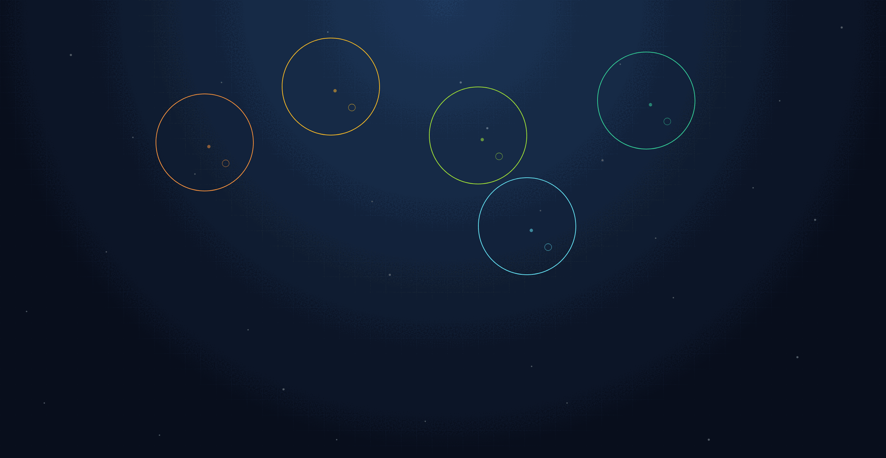

# Maths Game Template



> A production-ready starter kit for building interactive maths games — deployed as a PWA on Vercel in minutes.

**Live demo:** https://maths-game-template.vercel.app/

---

## What it is

A complete, battle-tested game framework. The demo game "Ripple Touch" ships inside it — tap the canvas to make ripples, count them, enter your answer. Every feature a real game needs is already built and wired up:

- Numeric keypad with DSEG7 LCD display
- Session reports emailed as PDF (via Resend)
- 5 built-in languages — English, Chinese, Spanish, Russian, Hindi — plus on-demand translation via OpenAI
- Autopilot mode for demos and end-to-end testing
- Web Audio synthesis (no sound files)
- Social sharing + embedded comments
- PWA — installable and offline-capable

**To build a new game:** replace `src/game/rippleGame.ts` with your own logic, and adapt `src/screens/RippleScreen.tsx` for your canvas. Everything else — layout, keypad, sound, reporting, i18n, autopilot — is already done.

---

## Quick start

```bash
git clone https://github.com/anandamarsh/maths-game-template.git my-game
cd my-game
npm install
npm run dev   # http://localhost:4005
```

---

## Stack

React 19 · TypeScript · Vite 8 · Tailwind CSS 4 · Vercel

---

## Docs

Full implementation details are in the **[`specs/`](./specs/)** folder — architecture, game loop, all component APIs, sound system, autopilot, i18n, deployment, and more.
